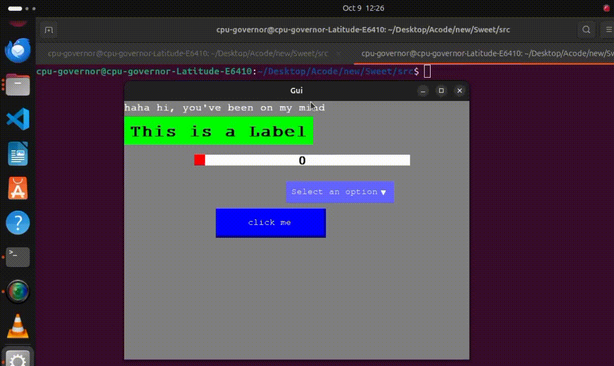
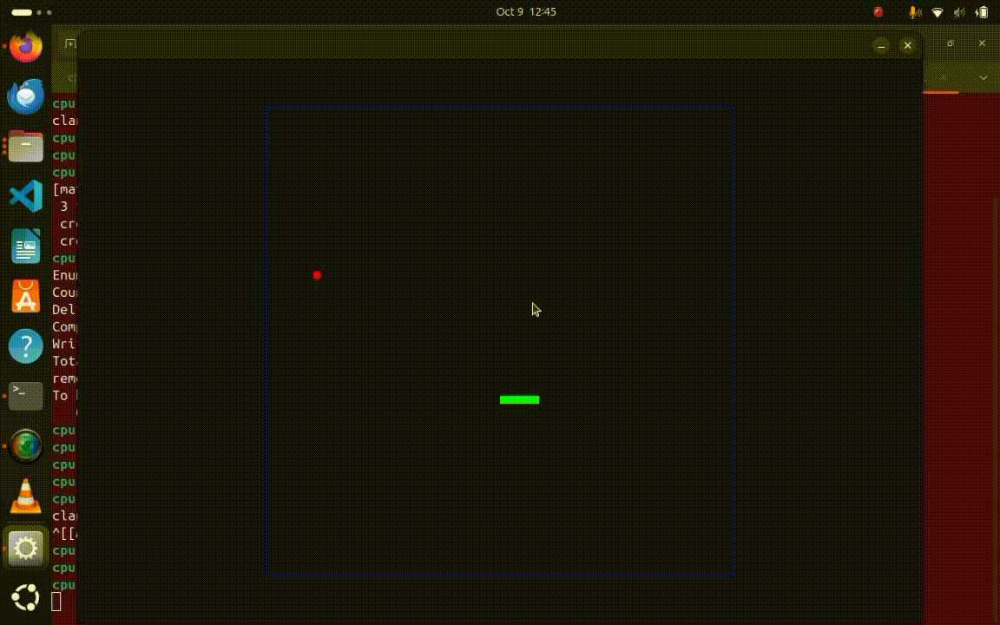
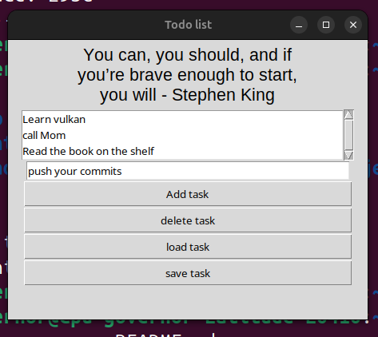

Hello! 

I am nze Okuchukwu, a Software Engineer focused on systems programming, computer graphics and Game Development. 
Currently I'm a 3rd year Computer Science student at Delta State university, abraka. 
i love building desktop applications with C++.

## Skills
C, C++, python, C#, linux, Godot.
## Contact info

Email: gpu.governor@gmail.com

[Resume](Resume.pdf)

[Github](https://github.com/gpu-governor)

[LinkedIn](https://www.linkedin.com/in/nze-okuchukwu-668913310/)

[X](https://x.com/gpu_governor)

[youtube](https://www.youtube.com/@GPU_Governor)

## Programming Projects

### Sweet Gui
A Graphical user interface library called Sweet, built in C and Simple Direct-Media Layer (SDL2).
	
##### Major Features:
* Retained mode: it uses a single gui_loop and rendering is only done when needed for optimal performance
* Light weight (around 1500 lines of C99 code).
* as of now 9/10/2024 it features basic widgets like sliders, Labels, text, buttons. other widgets are still in development
* Cross platform - Make based, with both Windows and Linux Support​. Tested with both clang.

-- [Source](https://github.com/gpu-governor/Sweet) --

##### Screenshots

 

### computer Graphics and Game development in SDL
i made mini projects like snake Game while learning SDL2, i also did some simulations
-- [Source](https://github.com/gpu-governor/Simple-SDL-Games) --

##### Screenshots
 
  
 
### python Gui Development in Tkinter
i have built a couple of desktop apps with tkinter and python, the one that stands out most is 'Go' - a gui todo list app i created for the august 2024 backdrop build code jam
##### Features
 * CRUD - task are saved to a .dat file and can be loaded even when the app was previously closed.
 * features a Quotes generated at random
 * Scaling supported.

-- [Source](https://github.com/gpu-governor/Go) -- 
 
##### Screenshot 
 

### Database System
A simple Data Base that writes data to .txt files, written in C

-- [Source](https://github.com/gpu-governor/Shell-projects) --
 
### Shell scripting projects
I built few shell scripting projects in bash like :
* Alarm clock : a simple Alarm clock in Shell, bash to be specific.
* A shell Script to display system information.+

-- [Source](https://github.com/gpu-governor/Shell-projects) --
 
